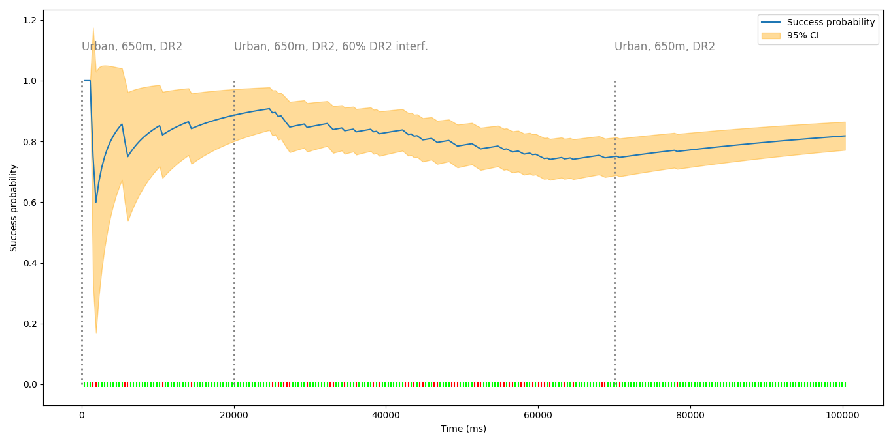

# LoRaSim
**LoRaSim** simulates LoRa traffic by means of Markov Chains as models. These models are readily available in the simulator, but the collection is expandable by the user. Different models can be interleaved for different time intervals in order to observe the effect of interference or of a change in the transceiver settings.

The result of the simulation is a plot showing how the delivery probability of a packet changes over time.

